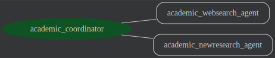

# Academic Research Agent (ADK + Vertex AI)

[](https://www.python.org/)
[](https://github.com/google/adk-python)
[](LICENSE)

## 🎯 Executive Summary
The **Academic Research Agent** is an advanced AI-driven orchestrator designed to automate the deep exploration of academic literature. By leveraging a multi-agent architecture built on Google's **Agent Development Kit (ADK)**, it transforms the traditionally manual process of literature review and gap analysis into a streamlined, high-signal workflow. 

This agent is ideal for research organizations, academic institutions, and R&D departments looking to accelerate their discovery phase and identify novel research frontiers with precision.

---

## 🏗️ Technical Architecture
The agent employs a **hierarchical multi-agent design**, where a central director coordinates specialized sub-agents to perform distinct phases of the research lifecycle.

### Components:
- **Director Agent (Root)**: The central orchestrator that manages the conversation state, task delegation, and synthesis of final outputs.
- **Academic Websearch Agent**: A specialized sub-agent equipped with Google Search capabilities to find contemporary citations and trace the real-world impact of seminal works.
- **Academic New-Research Agent**: An analytical sub-agent focused on cross-referencing original contributions with current trends to propose high-value future research directions.
- **Reasoning Engine (Vertex AI)**: The managed infrastructure providing secure, scalable execution and long-running operation (LRO) support.



---

## 🔄 Workflow Logic
The agent follows a deterministic three-stage research protocol:

1.  **Seminal Analysis**: Parses the provided seminal paper (via PDF, DOI, or URL) to extract core innovations, key methodologies, and foundational citations.
2.  **Impact Mapping**: Dispatches the `websearch` sub-agent to identify and retrieve recent academic publications (typically from the last 12-24 months) that build upon or challenge the original paper.
3.  **Synthesis & Frontier Discovery**: The `new-research` sub-agent synthesizes the original work with current literature to identify "research gaps" and suggest 10+ specific, actionable directions for future investigation.

---

## 🤝 Platform Integrations

### **Gemini Enterprise Integration**
This agent is built to be "Enterprise-Ready." It can be registered and surfaced directly within the **Gemini Enterprise** platform, allowing users to interact with it through the familiar Gemini interface while leveraging custom tools and organizational data.

### **Vertex AI Reasoning Engine**
The deployment uses the **Vertex AI Reasoning Engine (Agent Engine)**, which provides:
- **Scalability**: Automatic scaling of agent instances based on demand.
- **Observability**: Native integration with Google Cloud Logging and Tracing for debugging complex multi-agent reasoning paths.
- **Security**: IAM-managed access control and VPC-SC compatibility.

---

## 🔌 API Integration
Once deployed, the agent exposes a standardized API. Technical stakeholders can integrate this into existing research portals or internal dashboards.

### **Example: Programmatic Interaction (Python)**
```python
import vertexai
from vertexai import agent_engines

# Initialize
vertexai.init(project="gemini-enterprise-496008", location="us-east1")

# Access the deployed instance
agent = agent_engines.get("55098726691110912")

# Query the agent
response = agent.query(input="Analyze the paper 'Attention Is All You Need' and find citations from 2024.")
print(response)
```

---

## 🚀 Getting Started

### **1. Installation**
We recommend using **uv** for high-performance dependency management.
```bash
# Install the Google Agents CLI
uvx google-agents-cli setup

# Sync dependencies
uv sync --group dev
```

### **2. Configuration**
Create a `.env` file in the root directory:
```env
GOOGLE_CLOUD_PROJECT=gemini-enterprise-496008
GOOGLE_CLOUD_LOCATION=us-east1
GOOGLE_CLOUD_STORAGE_BUCKET=academic-research-496008
```

### **3. Authentication**
```bash
gcloud auth login
gcloud auth application-default login
```

---

## 🛠️ Local Development & Testing

### **Run the Agent (CLI)**
```bash
uv run adk run academic_research
```

### **Run the Web Playground**
```bash
uv run adk web
```

### **Run Automated Tests & Evals**
```bash
# Functional tests
uv run pytest tests

# AI-assisted evaluation (using ADK Evaluator)
uv run pytest eval
```

---

## ☁️ Deployment Guide
To deploy the agent to the cloud as a Vertex AI Reasoning Engine:

1.  **Deploy**:
    ```bash
    uv run deployment/deploy.py --create
    ```
2.  **Verify**:
    ```bash
    uv run deployment/deploy.py --list
    ```
3.  **Test Deployment**:
    ```bash
    uv run deployment/test_deployment.py --resource_id=YOUR_AGENT_ENGINE_ID --user_id=test_user
    ```

---

## 📝 Prerequisites Checklist
- [ ] **Google Cloud Project**: Active billing and project ID.
- [ ] **APIs Enabled**: `aiplatform.googleapis.com`, `storage.googleapis.com`.
- [ ] **Python 3.10+**: Environment managed by `uv`.
- [ ] **GCS Bucket**: Standard bucket for staging deployment artifacts.

---
## Disclaimer
This agent sample is provided for illustrative purposes only. Users are responsible for any further development, testing, security hardening, and deployment of agents based on this sample.
